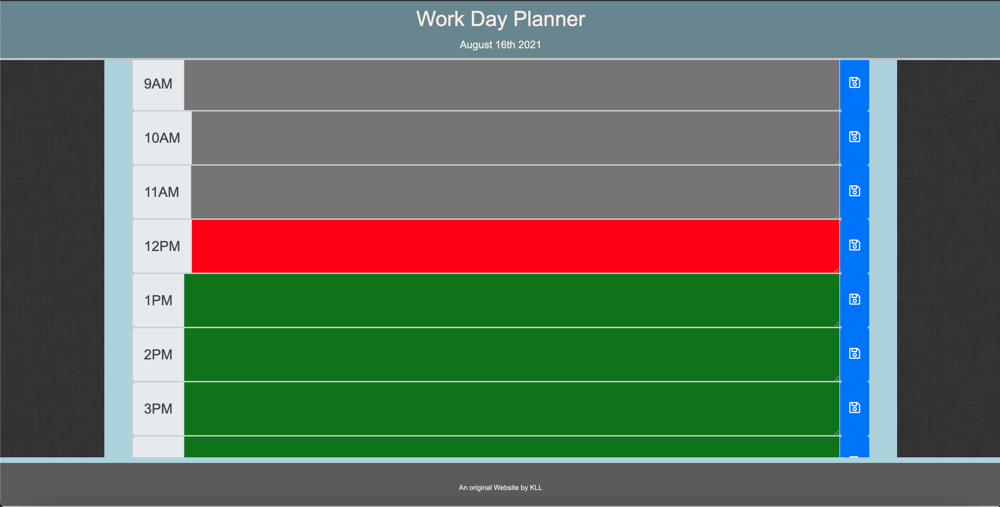

# Day Planner
    
## Table of Contents
* [Description](#description) 
* [Installation](#installation)
* [Usage](#usage)
* [Credits](#credits)
* [License](#license)
* [Badge](#badge)
* [Questions](#questions)
    
## Description
* Day Planner using javascript and moment.js 
    
## Installation
* no installation necessary.  place code in to directory on workstation and web browser to browse to localhost and directory to launch code.
    
## Usage
* planner allows for entries to be placed in text area and saved using the save button.  Can save day's activities and lets user know which activity is current by changing the background color.
    

## Credits
* N/A
    
## License
* Licensed by mit
    
## Badge
* 
    
## Questions
* For any questions, concerns, or additional help, please contact klucas72@hotmail.com.